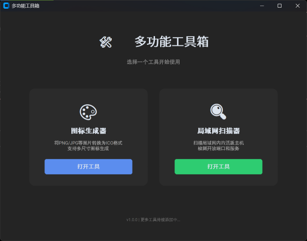

# 🛠️ UtilBox

一个现代化的多功能实用工具箱，集成图标生成、网络扫描等常用工具，支持Windows和Linux。


## 📸 界面预览




## ✨ 功能特性

### 🎨 图标生成器
- 🖼️ 支持多种图片格式（PNG, JPG, BMP, GIF）转ICO
- 📏 多尺寸ICO生成（16x16 到 256x256）
- 👁️ 实时图片预览和信息显示
- ⚡ 一键全选/清空尺寸选择
- 🎯 现代化深色主题界面

### 🔍 局域网扫描器
- 🌐 自动检测本机IP和网络段
- ⚡ 快速并发扫描局域网内活跃主机
- 🔌 检测常用端口（SSH, HTTP, Moonraker, API等）
- 📊 实时显示扫描进度和结果
- 💻 显示主机名和开放端口详情
- ⏸️ 支持随时停止扫描

## 🚀 快速开始

### 前置要求

- Python 3.13+
- [uv](https://github.com/astral-sh/uv) 包管理器

### 安装运行

```bash
# 克隆项目
git clone https://github.com/cuihuir/utilbox.git
cd utilbox

# 安装依赖
uv sync

# 运行主程序（需要X11支持）
uv run python utilbox.py

# 或者直接运行
python utilbox.py
```

### 单独测试工具

```bash
# 测试图标生成器
uv run python src/icon_generator.py

# 测试局域网扫描器
uv run python src/lan_scanner.py

# 测试核心功能（无需GUI）
uv run python tests/test_converter.py
uv run python tests/test_scanner.py
```

### Windows打包

```bash
# 1. 安装开发依赖
uv sync --extra dev

# 2. 运行打包脚本
uv run python scripts/build.py

# 3. 可执行文件位置
# dist/toolbox.exe
```

### Linux打包

```bash
# 1. 安装系统依赖
sudo apt install python3-tk

# 2. 安装开发依赖
uv sync --extra dev

# 3. 运行打包脚本
uv run python scripts/build.py

# 4. 可执行文件位置
# dist/toolbox

# 注意：打包后的程序需要目标机器安装Tcl/Tk库
# 在目标机器上运行：sudo apt install libtcl9.0 libtk9.0
```

## 📖 使用说明

### 主界面
启动程序后，在主界面选择需要使用的工具：
- **图标生成器** - 转换图片为ICO格式
- **局域网扫描器** - 扫描局域网设备

### 图标生成器使用流程
1. 点击"选择图片文件"按钮
2. 查看图片信息和预览
3. 选择需要的ICO尺寸（可使用全选/清空）
4. 点击"转换为ICO"并选择保存位置

### 局域网扫描器使用流程
1. 自动检测本机IP和网络段
2. 可手动修改网络段（如 192.168.1.0/24）
3. 点击"开始扫描"
4. 实时查看扫描结果（IP、主机名、开放端口）
5. 扫描完成后查看统计信息

## 🛠️ 技术栈

| 技术 | 说明 |
|------|------|
| **GUI框架** | CustomTkinter - 现代化跨平台界面 |
| **图片处理** | Pillow (PIL) - 强大的图像处理库 |
| **网络扫描** | socket + concurrent.futures - 高性能并发扫描 |
| **打包工具** | PyInstaller - 打包为独立可执行文件 |
| **包管理** | uv - 极速Python包管理器 |

## 📁 项目结构

```
utilbox/
├── utilbox.py               # 主程序启动入口
├── src/                     # 源代码目录
│   ├── __init__.py
│   ├── main_gui.py          # 主界面
│   ├── icon_generator.py    # 图标生成器页面
│   ├── lan_scanner.py       # 局域网扫描器页面
│   ├── converter.py         # 图片转换核心逻辑
│   └── scanner_core.py      # 网络扫描核心逻辑
├── scripts/                 # 脚本文件
│   └── build.py             # Windows打包脚本
├── tests/                   # 测试文件
│   ├── test_converter.py
│   └── test_scanner.py
├── docs/                    # 文档和截图
│   └── images/
│       ├── main.png
│       └── scanner.png
├── examples/                # 示例图片
├── .gitignore
├── .python-version
├── LICENSE
├── README.md
├── pyproject.toml
└── uv.lock
```

## 🔧 配置说明

### 扫描端口配置

默认扫描端口在 `scanner_core.py` 中定义：

```python
DEFAULT_PORTS = {
    22: "SSH",
    80: "HTTP",
    81: "HTTP-Alt",
    7125: "Moonraker",
    9080: "Device-API",
    50051: "Voice-API"
}
```

可根据需要修改端口列表。

## 📝 注意事项

- **WSL环境**: 需要X11服务器（WSLg或VcXsrv）才能运行GUI
- **Windows环境**: 可直接运行或打包成exe
- **扫描速度**: 取决于网络环境和主机数量，通常几秒到几十秒
- **防火墙**: 某些设备可能因防火墙设置无法被扫描到
- **权限**: 扫描功能无需管理员权限

## 🐛 问题排查

### WSL中无法显示GUI？
- 安装WSLg（Windows 11自带）
- 或安装X11服务器（如VcXsrv）
- 或直接在Windows上运行

### 打包失败？
- 确保已安装开发依赖：`uv sync --extra dev`
- 检查PyInstaller版本是否兼容
- **Windows**: 确保在Windows环境下打包
- **Linux**: 确保已安装 `python3-tk`

### Linux打包后无法运行？
- 错误：`libtcl9.0.so: cannot open shared object file`
- 解决：在目标机器上安装Tcl/Tk库
  ```bash
  sudo apt install libtcl9.0 libtk9.0
  ```
- 或者使用 `--onedir` 模式打包（会生成文件夹而非单文件）

### 扫描器无法发现设备？
- 检查防火墙设置
- 确认网络段配置正确（如 192.168.1.0/24）
- 某些设备可能禁用了端口响应
- 尝试增加扫描超时时间

### 图标转换失败？
- 确认图片格式支持（PNG, JPG, BMP, GIF）
- 检查图片文件是否损坏
- 确保有足够的磁盘空间

## 🚀 未来计划

- [ ] 添加更多实用工具
- [ ] 支持自定义端口扫描
- [ ] 批量图片转换
- [ ] 扫描结果导出（CSV/JSON）
- [ ] 多语言支持
- [ ] 主题切换（亮色/暗色）
- [ ] 配置文件保存用户偏好

## 🤝 贡献

欢迎提交Issue和Pull Request！

1. Fork 本项目
2. 创建特性分支 (`git checkout -b feature/AmazingFeature`)
3. 提交更改 (`git commit -m 'Add some AmazingFeature'`)
4. 推送到分支 (`git push origin feature/AmazingFeature`)
5. 开启Pull Request

## 📄 许可证

本项目采用 MIT 许可证 - 查看 [LICENSE](LICENSE) 文件了解详情

## 👨‍💻 作者

- 项目主页: [https://github.com/cuihuir/utilbox](https://github.com/cuihuir/utilbox)
- 问题反馈: [Issues](https://github.com/cuihuir/utilbox/issues)

## ⭐ Star History

如果这个项目对你有帮助，请给个Star支持一下！

---

**Built with ❤️ using Python and CustomTkinter**
