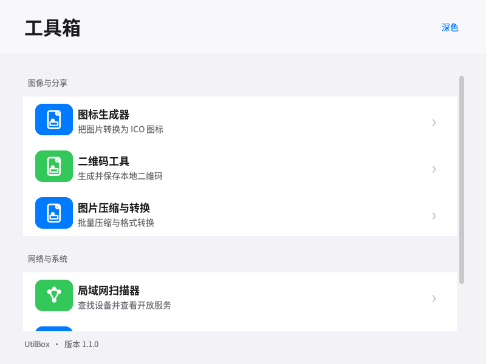

# UtilBox

一个离线优先的桌面实用工具箱，集成图片处理、二维码与网络诊断工具，支持 Windows、macOS 和 Linux。


## 功能

- **图标生成器**：将 PNG、JPG、BMP、GIF 转换为多尺寸 ICO。
- **图片压缩与转换**：批量输出 JPEG、PNG 或 WebP，可调整质量与输出目录。
- **二维码工具**：为文本、链接或 Wi-Fi 配置生成二维码，预览后保存 PNG。
- **局域网扫描器**：自动检测本机网络，扫描设备与常用开放服务。
- **本地端口占用**：查看监听端口、进程和 PID；可关闭进程，需要权限时由系统授权。
- **主题与缩放**：支持亮色/暗色模式，窗口内容可滚动并适应缩放。

## 界面预览



## 下载发行版

在 [Releases](https://github.com/cuihuir/utilbox/releases) 下载对应系统的文件。发行包包含 Python 运行环境，无需安装 Python 或 uv。

| 系统 | 文件 | 使用方式 |
| --- | --- | --- |
| Windows | `UtilBox-Windows-x64.zip` | 解压后运行 `UtilBox.exe` |
| macOS Apple Silicon | `UtilBox-macOS-arm64.zip` | 解压后打开 `UtilBox.app` |
| Ubuntu/Debian | `utilbox_*_amd64.deb` | `sudo apt install ./utilbox_*_amd64.deb` |
| Fedora/RHEL | `utilbox-*.x86_64.rpm` | `sudo dnf install ./utilbox-*.x86_64.rpm` |
| 通用 Linux | `UtilBox-*-x86_64.AppImage` | `chmod +x *.AppImage && ./*.AppImage` |

> macOS 未签名构建首次打开可能需要在“系统设置 - 隐私与安全性”中确认。
>
> AppImage 需要 FUSE 2：Fedora 安装 `sudo dnf install fuse-libs`，Debian/Ubuntu 安装 `sudo apt install libfuse2`。没有 FUSE 时，可运行 `./UtilBox-*.AppImage --appimage-extract-and-run`。

## 从源码运行

### 前置条件

- Python 3.13+；Linux 推荐使用系统 Python，以获得稳定的 Tk 渲染。
- [uv](https://github.com/astral-sh/uv)。

### Debian/Ubuntu

```bash
git clone https://github.com/cuihuir/utilbox.git
cd utilbox
bash install.sh
uv run python utilbox.py
```

### Fedora

```bash
sudo dnf install python3-tkinter google-noto-sans-cjk-vf-fonts google-noto-color-emoji-fonts
git clone https://github.com/cuihuir/utilbox.git
cd utilbox
uv sync --python /usr/bin/python3
uv run python utilbox.py
```

### 手动安装依赖

```bash
# Debian/Ubuntu
sudo apt install python3-tk fonts-noto-cjk fonts-noto-color-emoji

# 同步 Python 依赖并运行
uv sync
uv run python utilbox.py
```

## 使用说明

### 局域网扫描器

1. 应用自动填充本机网络。
2. 分段编辑 IPv4 地址与网络前缀，例如 `192.168.1.0 / 24`。
3. 点击“开始扫描”，在设备列表查看 IP、主机名和开放服务。

### 本地端口占用

1. 进入页面后后台读取监听端口。
2. 输入端口号后按 Enter 或点击“搜索”。
3. 点击一行以选中；使用“关闭”终止对应进程。

### 二维码工具

1. 输入文本、链接或 Wi-Fi 配置。
2. 点击“生成二维码”查看预览。
3. 点击“保存 PNG”选择保存位置。

### 图片压缩与转换

1. 选择一张或多张图片。
2. 选择 JPEG、PNG 或 WebP，并调整质量。
3. 选择输出目录后执行批量处理，完成后查看体积变化。

## 发布自动化

发布 GitHub Release 会触发 `.github/workflows/release.yml`：

- Windows Runner 构建 ZIP。
- macOS Runner 构建 `.app` ZIP。
- Ubuntu 构建 `.deb` 与 AppImage。
- Fedora 容器构建 `.rpm`。
- 所有产物自动上传到对应 Release。

## 技术栈

| 技术 | 用途 |
| --- | --- |
| CustomTkinter | 跨平台桌面界面 |
| Pillow | 图标生成、图片压缩与格式转换 |
| qrcode | 本地二维码生成 |
| psutil | 本机端口与进程信息 |
| socket + concurrent.futures | 局域网扫描 |
| PyInstaller | 多平台发行包构建 |

## 注意事项

- WSL 需要 WSLg 或 X11 服务器才能显示 GUI。
- 局域网扫描结果受防火墙、设备响应策略和网络环境影响。
- 关闭受保护进程时会请求系统授权；请确认目标进程后再继续。
- AppImage 需要匹配 CPU 架构；部分发行版可能需要安装 FUSE 兼容库。

## 贡献与许可证

欢迎提交 Issue 和 Pull Request。项目采用 [MIT License](LICENSE)。
